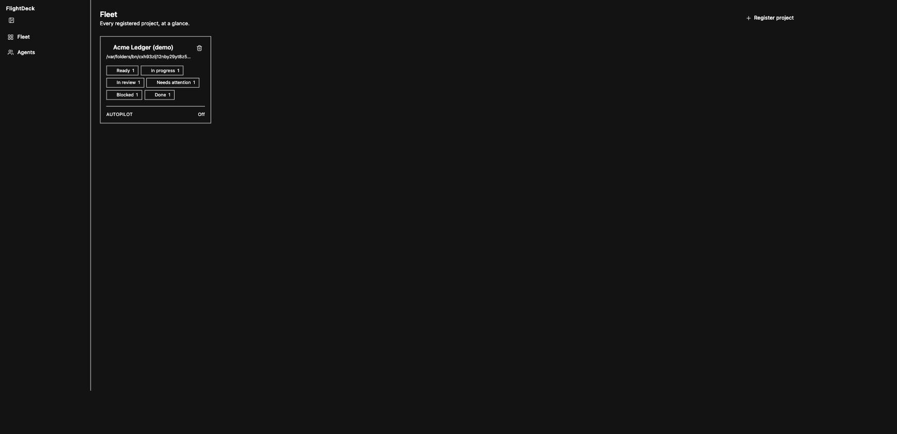
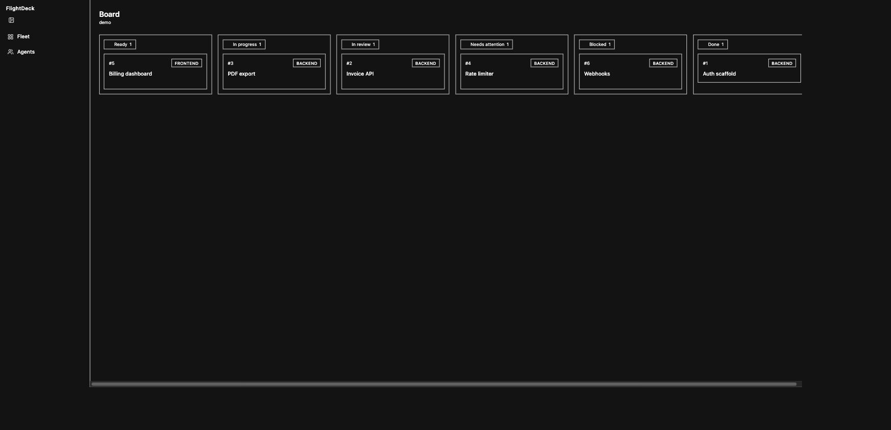

# FlightDeck

The CEO console for a team of coding agents: one screen that shows every registered
project's ticket queue, who's working right now, and lets a human dispatch work and
approve merges. Self-hosted, single binary, no database of its own for anything that
matters.

## What it is

The vibe-coding setup runs coding agents against a file-based ticket queue
(`docs/tickets/*.md`), but driving it means jumping between a terminal `/board`, `claude
agents`, GitHub, and a `curl` command to dispatch. FlightDeck puts all of that in one
place: see every project and its derived ticket statuses, see which agents are working,
dispatch the next ticket (or a specific one), and approve merges — the human gives
direction, the agents execute. See [`docs/PRD.md`](docs/PRD.md) for the full product
story.

## The core principle: derive, never store

FlightDeck owns **no ticket database**. Every time you load a board, it reads a
project's `docs/tickets/*.md` plus its git branches and PR/CI state, live, and computes
each ticket's status with the same rules the agents themselves use — a ticket is `done`
because its branch merged, not because some dashboard row says so.

This is deliberate, not an oversight (see [ADR-001](docs/decisions/ADR-001-derive-never-store.md)).
A dashboard that keeps its own copy of status drifts from what the agents actually see,
and a stale control surface is worse than no control surface at all. The only thing
FlightDeck persists is its own config: which projects are registered, and their secrets
— never a ticket's status.

## Build

```sh
# 1. build the UI and copy it into the embed directory
cd ui && npm ci && npm run build && cd ..
cp -r ui/dist/. internal/webui/dist/

# 2. build the single binary
go build -o bin/flightdeck ./cmd/flightdeck
```

## Run

```sh
FLIGHTDECK_TOKEN=<random-secret> ./bin/flightdeck serve
# dev loop instead: FLIGHTDECK_TOKEN=<secret> go run ./cmd/flightdeck serve
```

| Var | Default | Notes |
|---|---|---|
| `FLIGHTDECK_TOKEN` | *(none — required)* | Startup fails fast with a clear error if empty |
| `FLIGHTDECK_ADDR` | `:8080` | API and UI share this one port |
| `FLIGHTDECK_DB` | `flightdeck.db` | SQLite registry file; gitignored |

`flightdeck version` prints the version.

### Zero-setup: demo mode

No real repository to point it at yet? Run:

```sh
./bin/flightdeck serve --demo
```

This seeds a small fixture project (a fictional invoicing service) with tickets across
every derived status — done, in review, in progress, needs attention, ready, blocked —
built from a throwaway local git repository, no network or real remote required. In
demo mode, `FLIGHTDECK_TOKEN` and `FLIGHTDECK_DB` default to known dev values when you
haven't set them, so the whole thing runs with nothing configured; the token FlightDeck
picked is printed to stdout on startup so you can log in.

## Register a project

The API is cookie-authenticated: trade the bearer token for a session cookie once, then
use the cookie.

```sh
curl -X POST -H "Authorization: Bearer $FLIGHTDECK_TOKEN" \
  http://localhost:8080/api/session -c cookies.txt

curl -b cookies.txt -X POST -H "Content-Type: application/json" \
  -d '{"name":"My Project","repo_path":"/absolute/path/to/a/checkout"}' \
  http://localhost:8080/api/projects

curl -b cookies.txt http://localhost:8080/api/projects/my-project/board
```

`repo_path` is a **local checkout** whose `docs/tickets/*.md` FlightDeck reads directly.
Add `"github": {"owner":"…","repo":"…"}` to also enable PR/CI state; without it the
board still renders from git alone, with CI shown as unknown. The project id is a slug
of its name.

## Setting routine / GitHub tokens

A project's routine dispatch token and GitHub token live server-side in the registry's
SQLite file, in a `project_secrets` table separate from the project itself
(`internal/registry`). Dispatching a ticket and reading PR/CI state both read a
project's tokens through `registry.Store.Secrets`; nothing else ever touches them.

There is no HTTP endpoint yet for *writing* a project's secrets — only the read side is
wired into the API today. Until that lands, set them server-side with
`registry.Store.SetSecrets(ctx, projectID, registry.Secrets{RoutineToken: "...", GitHubToken: "..."})`
against the same DB file the server uses (stop the server first, or use a copy, to avoid
racing a live SQLite write).

**Security note:** routine and GitHub tokens are stored only in that local SQLite file
and are read server-side only — they are never sent to the browser, never logged, and
never committed (see [ADR-005](docs/decisions/ADR-005-secrets-store.md)). `core.Project`,
the DTO every project-listing endpoint returns, carries no token field by construction.

## Screenshots


*Fleet — every registered project at a glance, ticket counts by derived status.*


*Board — one project's queue as a kanban, columns computed live from git.*

What the board looks like, roughly:

```
 ready        in_progress    in_review     needs_attn     blocked       done
┌──────────┐ ┌───────────┐ ┌───────────┐ ┌───────────┐ ┌──────────┐ ┌──────────┐
│ #5        │ │ #3         │ │ #2         │ │ #4         │ │ #6        │ │ #1        │
│ billing-  │ │ pdf-export │ │ invoice-   │ │ rate-      │ │ webhooks  │ │ auth-     │
│ dashboard │ │            │ │ api        │ │ limiter    │ │           │ │ scaffold  │
└──────────┘ └───────────┘ └───────────┘ └───────────┘ └──────────┘ └──────────┘
```

## More

- [`docs/PRD.md`](docs/PRD.md) — product requirements
- [`docs/ARCHITECTURE.md`](docs/ARCHITECTURE.md) — package layout, derivation rules, the
  frozen API contract
- [`docs/DESIGN.md`](docs/DESIGN.md) — the design system the UI is built from
